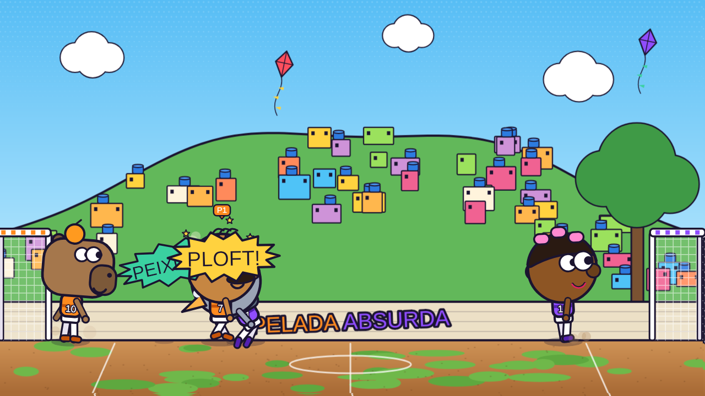

# Pelada Absurda

Futebol 2D de bonecos molengas onde **as regras mudam no meio do jogo**. Gravidade da Lua, bola de boliche,
chuva de melancia, controle invertido… Jogue sozinho contra bots ou chame até 4 amigos no mesmo PC.



## Como jogar

| | Andar | Pular | Chutar | Carrinho / peixinho |
|---|---|---|---|---|
| **Teclado 1** | `A` `D` | `W` | `F` ou `Espaço` | `G` ou `S` |
| **Teclado 2** | `←` `→` | `↑` | `K` ou `Enter` | `L` ou `↓` |
| **Controle** (Xbox / PlayStation) | Analógico ou direcional | `A` / `✕` | `B` `X` / `○` `□` | `Y` `RB` / `△` `R1` |

- **Bicicleta:** chute no ar com a bola acima da cabeça manda a bola para trás.
- **Carrinho:** derruba quem estiver na frente. No ar, o mesmo botão vira **peixinho** (cabeçada voadora).
- **Chutar o adversário** também derruba ele, quando o chute não pega na bola.
- `P` / `Esc` / `Start` pausa.

## Regras absurdas

A cada rodada (15, 25 ou 40 s) o juiz sorteia uma regra. Da metade do jogo em diante caem **duas de uma vez**.

| Regra | O que acontece |
|---|---|
| Gravidade Lunar | Todo mundo flutua |
| Bola de Boliche | Pesada, quica pouco e derruba quem estiver no caminho |
| Bola de Praia | Gigante e levinha |
| Bola Pula-Pula | Quica sem perder força |
| Cabeção | Cabeças em tamanho família |
| Time Tampinha | Todo mundo encolhe |
| Gol de Pebolim / Gol de Gigante | Traves encolhem ou crescem |
| Campo Ensaboado | Ninguém consegue frear |
| Ventania | Vento que troca de lado a cada 6 s |
| Multibola | Três bolas em campo |
| Pernas de Mola | Pulo muito mais alto |
| Controle Invertido | Esquerda vira direita (só para humanos) |
| Chuva de Melancia | Melancias caindo do céu |
| Gol Vale 3 | Cada gol vale três pontos |
| Modo Turbo | Tudo 35% mais rápido |
| Bola Fantasma | A bola some de vez em quando |

## Funcionalidades

- **1v1 ou 2v2**, cada vaga pode ser teclado, controle, bot ou ninguém
- **Bots** em três níveis: Perna de Pau, Boleiro e Craque
- **8 personagens**: Tiozão, Vovó Turbo, Craque Mirim, Tia do Zap, Capivara, Pombo, Robô Peladeiro e Cabeça de Bagre
- **4 estádios**: Campo de Várzea, Futevôlei na Praia, Estádio à Noite e Pelada na Laje
- Física molenga (braços e olhos com mola), narrador zoeiro, câmera lenta no gol, morte súbita no empate
- Samba de fundo e efeitos sonoros sintetizados na hora
- Prêmios no fim: Craque da Pelada, Saco de Pancada e Pé Torto

## Tecnologias

HTML, CSS e JavaScript puro, sem bibliotecas nem etapa de build.

- **Canvas 2D** para todo o desenho: personagens, estádios e efeitos são gerados por código (nenhuma imagem)
- **Física própria** (gravidade, colisão círculo-círculo e círculo-segmento, molas para o efeito molenga)
- **Web Audio API** para sons e música
- **Gamepad API** para controles
- **localStorage** para lembrar a escalação e as configurações

## Estrutura

```
├── index.html      # telas, HUD e menus
├── css/style.css   # visual da interface
└── js/game.js      # física, bots, regras, desenho e áudio
```

## Rodando localmente

Abra o `index.html` no navegador, ou sirva a pasta:

```bash
npx serve .
# ou
python -m http.server 8000
```

## Licença

MIT
